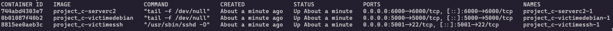

# Projet C – POC Malware `LD_PRELOAD` avec serveur C2

Ce projet est une preuve de concept (POC) d’un malware en C utilisant la technique `LD_PRELOAD`.  
Il intercepte certaines fonctions du système pour récupérer des identifiants SSH, les transmettre à un serveur de commande et contrôle (C2), et installer une persistance sur la machine ciblée.

---

## Fonctionnalités principales

- **Base de données locale en C (B-Tree)**  
  Implémentation d'une base de données en C utilisant une structure B-Tree pour stocker les identifiants exfiltrés.

- **Serveur C2 sécurisé (SSL)**  
  Serveur en C basé sur OpenSSL, qui reçoit les identifiants depuis les machines infectées.

- **Malware (`LD_PRELOAD`)**  
  Bibliothèque partagée chargée via `LD_PRELOAD` pour :
  - Hooker les fonctions système sensibles (`read`, `write`, `open`, `readdir`, etc.)
  - Intercepter les mots de passe SSH saisis par l'utilisateur
  - Exfiltrer les données vers le serveur C2
  - Masquer la présence du fichier `/etc/ld.so.preload`

- **Loader factice (générateur de V-Bucks)**  
  Faux binaire simulant un générateur de V-Bucks :
  - Télécharge le malware depuis le serveur C2
  - Installe `/etc/ld.so.preload` pour activer la persistance

---

## Disclaimer

Ce projet a été réalisé dans un cadre éducatif par un étudiant.  
Il s'agit de mon tout premier véritable projet en langage C.

- Le code peut contenir des erreurs ou ne pas respecter les meilleures pratiques.
- L’auteur ne pourra être tenu responsable de toute utilisation abusive ou malveillante de ce projet.
# Projet C – POC Malware `LD_PRELOAD` avec serveur C2

Ce projet est une preuve de concept (POC) d’un malware en C utilisant la technique `LD_PRELOAD`. Il intercepte certaines fonctions du système pour récupérer des identifiants SSH, les transmettre à un serveur de commande et contrôle (C2), et installer une persistance sur la machine ciblée.

---

## Fonctionnalités principales

- **Base de données locale en C (B-Tree)**  
  Structure B-Tree pour stocker localement les identifiants exfiltrés via des sockets.

- **Serveur C2 sécurisé (SSL)**  
  Serveur en C avec OpenSSL pour recevoir les identifiants en provenance des clients infectés.

- **Malware (LD_PRELOAD)**  
  Bibliothèque injectée en utilisant `LD_PRELOAD` pour :
  - Hooker des fonctions comme `read`, `write`, `open`, `readdir`…
  - Intercepter les mots de passe SSH saisis par l'utilisateur.
  - Envoyer les identifiants au serveur C2.
  - Cacher la présence du fichier `/etc/ld.so.preload`.

- **Loader (générateur de V-Bucks)**  
  Binaire trompeur affichant un faux générateur de V-Bucks :
  - Télécharge le malware depuis le serveur C2.
  - Installe le fichier `/etc/ld.so.preload` pour activer la persistance.


## Disclaimer

Ce projet a été réalisé **dans un cadre éducatif** par un étudiant.  
Il s'agit de **mon tout premier véritable projet en langage C**.

- Le code peut contenir des erreurs, être incomplet ou ne pas respecter les meilleures pratiques.
- L’auteur **n’est en aucun cas responsable** des conséquences d’une utilisation abusive, malveillante ou illégale de ce projet.
- Ce POC est fourni **à titre purement pédagogique** pour expérimenter et comprendre :
  - l’utilisation de `LD_PRELOAD` pour le hooking de fonctions système,
  - la persistance via `/etc/ld.so.preload`,
  - la communication avec un serveur C2 via SSL,
  - la manipulation de structures de données (B-Tree) en C.


---

## Modes d'utilisation

Ce projet peut être utilisé de **deux façons différentes** selon votre environnement :

### 1. Exécution en local (manuelle)

Vous pouvez télécharger le code source, compiler les différents modules (`malware.so`, `server C2`, `loader`, etc.), puis tester le fonctionnement sur votre propre machine ou dans une VM Linux.

Cette méthode vous laisse un contrôle total, mais nécessite de configurer l’environnement manuellement (compilation, installation de OpenSSL, configuration des sockets, etc.).

---

### 2. Utilisation avec Docker (recommandé)

Un environnement Docker complet est fourni pour simplifier les tests.  
Il se compose de **trois conteneurs** :

| Conteneur        | Rôle                                                             
|------------------|-----------------------------------------------------------------
| `sshvictims`     | Serveur SSH sur lequel la victime va tenter de se connecter     
| `victimsdebian`  | Machine infectée par le malware (`LD_PRELOAD`)                  
| `c2server`       | Contient le **serveur C2 SSL**, la **base de données** et le **malware à télécharger**

---

###  Architecture simplifiée

```text
+------------------+          +---------------------+          +-------------------+
|                  |          |                     |          |                   |
|   sshvictims     |  <─────  |   victimsdebian     |  ─────>  |     c2server      |
|  (Serveur SSH)   |          |   (Malware actif)   |          | (SSL + DB + .so)  |
|                  |          |                     |          |                   |
+------------------+          +---------------------+          +-------------------+


- Ce projet est fourni à des fins purement pédagogiques afin de comprendre :
  - L’utilisation de `LD_PRELOAD` pour le hooking de fonctions système
  - La persistance via `/etc/ld.so.preload`
  - La communication SSL avec un serveur C2
  - L’implémentation d’une structure B-Tree en C

---

## Modes d'utilisation

Ce projet peut être utilisé de deux façons différentes selon votre environnement :

### 1. Exécution en local (manuelle)

Téléchargez le code source, compilez les différents modules (`malware.so`, `server C2`, `loader`, etc.) puis exécutez-les dans une machine virtuelle ou un environnement de test.

Cette méthode offre un contrôle total, mais nécessite l’installation manuelle des dépendances (OpenSSL, compilation C, etc.).

---

### 2. Utilisation avec Docker (recommandée)

Un environnement Docker est fourni pour automatiser la configuration.  
Il comprend trois conteneurs distincts :

| Conteneur        | Rôle                                                                 |
|------------------|----------------------------------------------------------------------|
| `sshvictims`     | Serveur SSH auquel la victime se connecte                            |
| `victimedebian`  | Machine infectée par le malware `LD_PRELOAD`                         |
| `serverc2`       | Serveur C2 contenant le binaire `malware.so`, la base B-Tree et l’interface SSL |

---

### Architecture simplifiée

```text
+------------------+          +---------------------+          +-------------------+
|                  |          |                     |          |                   |
|   sshvictims     |  <─────  |   victimsdebian     |  ─────>  |     serverc2      |
|  (Serveur SSH)   |          |   (Malware actif)   |          | (SSL + DB + .so)  |
|                  |          |                     |          |                   |
+------------------+          +---------------------+          +-------------------+
## Adresses IP des conteneurs Docker

Chaque conteneur du projet Docker fonctionne sur un sous-réseau privé dédié : `172.21.0.0/16`.  
Les adresses IP sont **fixes** pour simplifier la communication entre services :

| Conteneur        | IP attribuée     | Rôle                                                                         |
|------------------|------------------|------------------------------------------------------------------------------|
| `victimedebian`  | `172.21.0.10`    | Machine cible infectée par le malware `LD_PRELOAD`.                          |
| `victimessh`     | `172.21.0.11`    | Serveur SSH sur lequel la victime se connecte pour piéger le mot de passe.   |
| `serverc2`       | `172.21.0.12`    | Serveur C2 (SSL) recevant les identifiants et stockant dans une base B-Tree. |


- `5000` → terminal de `victimedebian`
- `5001` → SSH vers `victimessh`
- `6000` -> serveur C2 (réception des identifiants)
- `7777` -> base de donnée dans le server C2 


---

## Compilation

Il existe deux façons de compiler le projet :

### 1. Avec le Makefile (recommandé)

Un fichier Makefile est fourni à la racine du projet. Il permet de compiler automatiquement tous les composants.

Commande :

make

Cela génère les exécutables suivants :

- db/projectdb : base de données B-Tree en C
- server/server : serveur C2 SSL
- server/malware.so : bibliothèque LD_PRELOAD compilée
- ldpreload_malware/loader/loader : faux générateur de V-Bucks

Pour supprimer les fichiers compilés :

make clean

---

### 2. Compilation manuelle (optionnel)

Il est également possible de compiler chaque partie séparément.

Base de données :

gcc -Wall -Wextra db/src/*.c -o db/projectdb

Serveur C2 :

gcc -Wall -Wextra server/*.c -lssl -lcrypto -lpthread -o server/server

Malware (LD_PRELOAD) :

gcc -Wall -Wextra -fPIC -shared ldpreload_malware/malware/*.c -o server/malware.so

Loader :

gcc -Wall -Wextra -lssl -lcrypto -lpthread ldpreload_malware/loader/loader.c -o ldpreload_malware/loader/loader

---

### Prérequis

Assurez-vous d’avoir installé :

- gcc
- make
- libssl-dev
- Système Linux (pour LD_PRELOAD, /proc, etc.)

---

## Utilisation

### Étape 1 : Compiler et lancer l'environnement

Lance la compilation complète avec la commande `make`, puis démarre les conteneurs Docker avec `docker compose up --build -d`.

Cette étape compile tous les exécutables du projet (base de données, serveur, malware, loader) et lance les trois conteneurs : victimedebian, sshvictims et serverc2.



### Étape 2 : Ouvrir les terminaux, lancer les services et exécuter le loader

Ouvre trois terminaux et utilise la commande docker exec -it nom_du_conteneur /bin/bash pour accéder à victimedebian (la machine victime) et deux fois à serverc2,
puis dans le premier terminal de serverc2 exécute ./server pour lancer le serveur C2, dans le second fais cd db puis ./projectdb pour lancer la base de données,
et enfin sur victimedebian exécute sudo ./loader pour initier la connexion, télécharger le fichier malware.so et l’injecter dans ld.so.preload.


### Étape 3 : Se connecter en SSH et déclencher la récupération des identifiants

Le malware étant désormais actif sur victimedebian, connecte-toi en SSH à la machine sshvictims avec la commande ssh sshvictims@172.21.0.11 en utilisant des identifiants valides,
patiente quelques secondes puis déconnecte-toi, 
ensuite exécute une requête curl comme curl https://example.com/ pour déclencher la récupération automatique des identifiants par le serveur C2 qui les enverra à la base de données.


### Étape 4 : Vérifier que les identifiants SSH ont bien été récupérés

Après la requête curl, les identifiants SSH sont automatiquement envoyés par le malware au serveur C2,
qui les stocke dans la base de données accessible depuis le terminal projectdb, et tu peux alors voir que les identifiants ont bien été interceptés et enregistrés.


